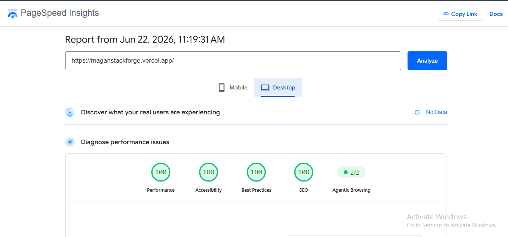
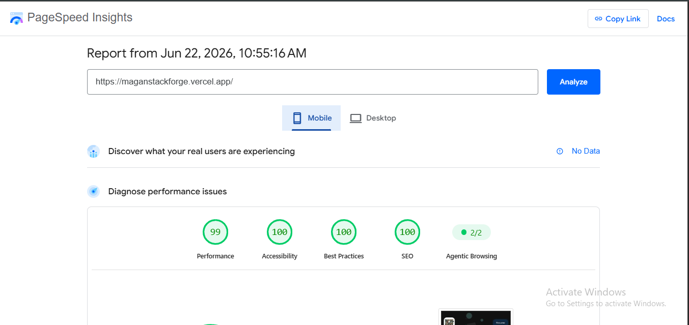

## ProCoderX Portfolio

A modern, responsive, and performance-focused developer portfolio built using React.js, Vite, and Tailwind CSS.

The portfolio showcases my projects, technical skills, certifications, and frontend development journey with a strong focus on performance, accessibility, SEO, responsive design, and clean UI/UX.

---

## 🔗 Important Links

🌐 Live Portfolio: https://procoderx.com
⚡ Vercel Deployment: https://theprocoderx.vercel.app
💻 Source Code: https://github.com/theprocoderx/procoderx-portfolio
🐙 GitHub: https://github.com/theprocoderx
💼 LinkedIn: https://linkedin.com/in/procoderx
📧 Email: procoderxs@gmail.com

---

## 📸 Screenshots

### 🏠 Hero Section


### 🚀 Projects Section


### 🪟 About Modal


### 🏆 Certifications


### 📬 Contact Section


---

## 📊 Performance Quality Proof

### Lighthouse Results

- Mobile Performance: 99/100
- Desktop Performance: 100/100
- Accessibility: 100/100
- Best Practices: 100/100
- SEO: 100/100




⚡ PageSpeed Report: https://pagespeed.web.dev/analysis/https-procoderx-com/spxw2ae6ju?form_factor=desktop

---

## 📄 Portfolio Sections (SPA)

This is a **Single Page Application (SPA)** with the following sections:

### 🏠 Hero Section

- Developer introduction
- Name: Magan Singh
- Role and short tagline
- Call-to-action buttons

### 👨‍💻 About Modal

- Opens via "About Me" button
- Professional summary
- Skills overview
- Tools & technologies
- Core development concepts

### 🚀 My Projects

- Featured projects showcase
- Tech stack used in each project
- Links to GitHub / live previews (if available)

### 🏆 Certifications

- Professional certifications
- Learning achievements and skill validations

### 📬 Contact Section

- Email and social links
- Easy connection options for recruiters

### 🔻 Footer

- Quick navigation links
- Social media profiles
- Copyright and branding info

---

## 🧰 Tech Stack

### Frontend

- 

- 
- 
- 
- 
- 

---

### Animation & UI

- 
- 
- 

---

### 3D / Physics Effects

- 

---

### SEO & Optimization

- 
- 

---

### Tools & Deployment

#### Version Control & Dev Tools

- 
- 

#### Development Environment

- 
- 

#### Deployment

- 
- 

#### Code Quality

- 
- 
- 

---

## ⚡ Key Features

- Fully responsive design (Mobile / Tablet / Desktop)
- Interactive and animated UI
- Smooth scrolling experience
- Dynamic About modal system
- Project showcase with clean UI structure
- Certification section for achievements
- Reusable and modular component architecture
- Modern frontend best practices (React + Vite + Tailwind)
- Optimized performance and fast loading experience
- SEO-friendly SPA structure

---

## ⚡ Performance Optimizations

- Code splitting with Vite for faster load times
- Lazy loading of components and images
- Optimized asset delivery (WebP/compressed images)
- Bundle size analysis using Vite Visualizer
- Optimized re-rendering with efficient React component structure
- Lightweight production build for better performance
- Responsive image handling for all devices
- Optimized font loading
- Optimized hero image loading using preload for better LCP performance (avoiding redundant fetchPriority usage)

---

## 🔍 SEO Features

- Custom domain with HTTPS
- XML Sitemap (`sitemap.xml`)
- robots.txt configuration
- Canonical URLs
- Structured Data (JSON-LD)
- Open Graph & Twitter Card meta tags
- Google Search Console integration
- Sitemap submitted for search engine indexing
- SEO-friendly metadata
- Optimized for search engine discoverability

---

## 📁 Project Structure

```text
procoderx-portfolio
│
├── public
│   └── screenshots
│       ├── hero-desktop.png
│       ├── hero-mobile.png
│       ├── projects-desktop.png
│       ├── projects-mobile.png
│       ├── about-desktop.png
│       ├── about-mobile.png
│       ├── cert-desktop.png
│       ├── cert-mobile.png
│       ├── contact-desktop.png
│       ├── contact-mobile.png
│       ├── lighthouse-desktop.png
│       └── lighthouse-mobile.png
│
├── src
│   ├── animations
│   ├── assets
│   ├── components
│   ├── styles
│   ├── App.css
│   ├── App.jsx
│   ├── index.css
│   └── main.jsx
│
├── index.html
├── package.json
├── vite.config.js
└── README.md
```

---

## ⚙️ Installation & Setup

```bash
git clone https://github.com/theprocoderx/procoderx-portfolio.git
cd procoderx-portfolio
npm install
npm run dev
```

## 🏗️ Build

```bash
npm run build
```

---

## 🚀 Future Improvements

- Blog section
- Project search & filtering
- Contact form backend integration
- CMS-powered content management
- PWA support

---

## 👨‍💻 Author

**Magan Singh**  
Frontend Developer Intern @ Namrata Universal (Nov 2025 – Present)  
MCA Graduate | React.js | JavaScript | Tailwind CSS | Vite

---

## 📄 License

This project is intended for portfolio showcase, learning purposes, and personal branding. Unauthorized copying or redistribution of the content is not permitted.
