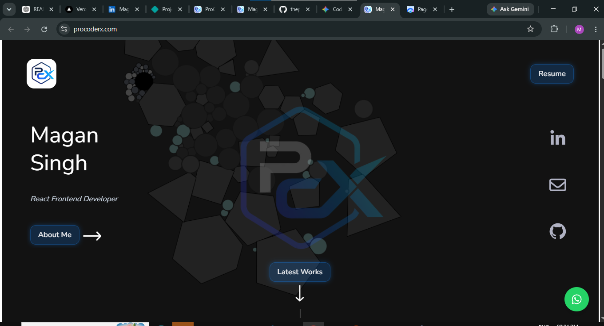
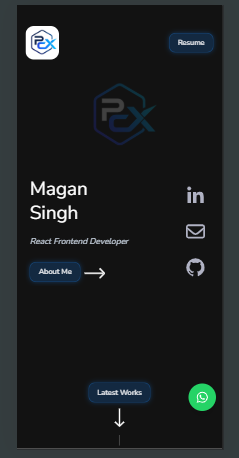
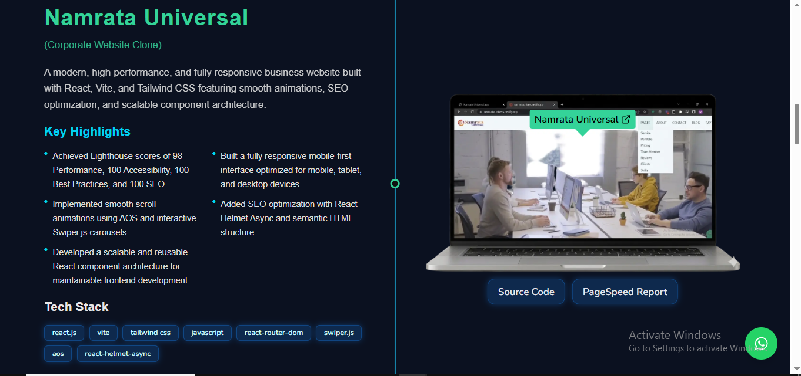
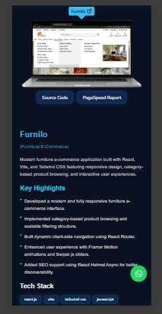
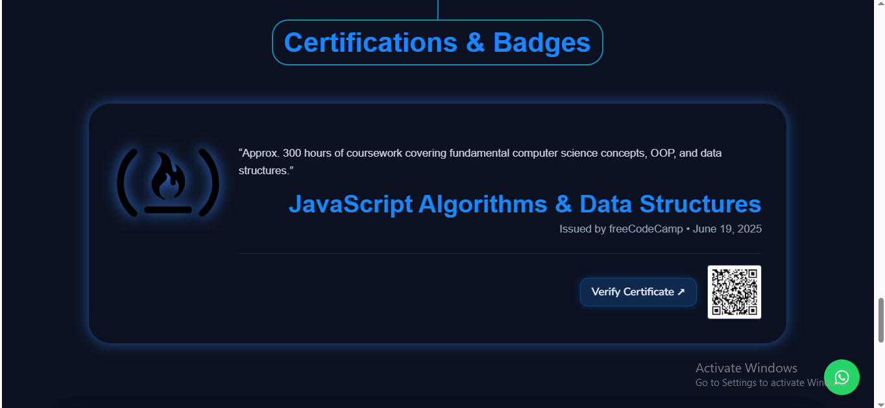
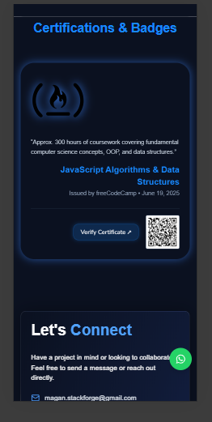
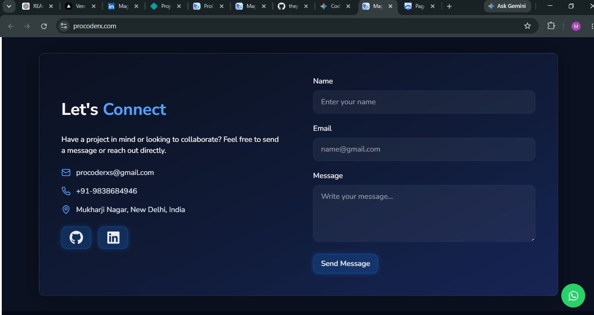
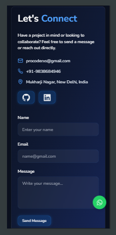

# Magan Singh Portfolio

Magan Singh Portfolio is a modern, responsive, and performance-focused personal developer portfolio built using React.js, Vite, and Tailwind CSS.

It showcases my projects, skills, certifications, and frontend development journey through a clean and interactive single-page experience.

---

## 🔗 Important Links

🌐 Portfolio Website: https://maganstackforge.vercel.app/  
⚡ PageSpeed Report: https://pagespeed.web.dev/report?url=https://maganstackforge.vercel.app/  
💻 GitHub Profile: https://github.com/maganstackforge  
📂 Project Repository: https://github.com/maganstackforge/msf-portfolio  
👤 LinkedIn: https://linkedin.com/in/maganstackforge  
📧 Email: magan.stackforge@gmail.com

---

## 📄 Portfolio Sections (SPA)

This is a **Single Page Application (SPA)** with the following sections:

### 🏠 Hero Section

- Developer introduction
- Name: Magan Singh
- Role and short tagline
- Call-to-action buttons

### 👨‍💻 About Modal

- Opens via "About Me" button
- Professional summary
- Skills overview
- Tools & technologies
- Core development concepts

### 🚀 My Projects

- Featured projects showcase
- Tech stack used in each project
- Links to GitHub / live previews (if available)

### 🏆 Certifications

- Professional certifications
- Learning achievements and skill validations

### 📬 Contact Section

- Email and social links
- Easy connection options for recruiters

### 🔻 Footer

- Quick navigation links
- Social media profiles
- Copyright and branding info

---

## 🧰 Tech Stack

### Frontend

- 

- 
- 
- 
- 
- 

---

### Animation & UI

- 
- 
- 

---

### 3D / Physics Effects

- 

---

### SEO & Optimization

- 
- 

---

### Tools & Deployment

#### Version Control & Dev Tools

- 
- 

#### Development Environment

- 
- 

#### Deployment

- 
- 

#### Code Quality

- 
- 
- 

---

## ⚡ Key Features

- Fully responsive design (Mobile / Tablet / Desktop)
- Interactive and animated UI
- Smooth scrolling experience
- Dynamic About modal system
- Project showcase with clean UI structure
- Certification section for achievements
- Reusable and modular component architecture
- Modern frontend best practices (React + Vite + Tailwind)
- Optimized performance and fast loading experience
- SEO-friendly SPA structure

---

## ⚡ Performance Optimizations

- Code splitting with Vite for faster load times
- Lazy loading of components and images
- Optimized asset delivery (WebP/compressed images)
- Bundle size analysis using Vite Visualizer
- Optimized re-rendering with efficient React component structure
- Lightweight production build for better performance
- Responsive image handling for all devices
- Optimized hero image loading using preload for better LCP performance (avoiding redundant fetchPriority usage)

---

## 📊 Performance & Build Quality Proof

### 🧹 Code Quality Checks (ESLint + Prettier Format)


### 👀 Production Build and Preview (Vite Preview)


### 📊 Lighthouse Audit


---

## 📁 Project Structure

```bash
MS_PORTFOLIO
│
├── public
│   ├── screenshots
│   │   ├── hero.png
│   │   ├── projects.png
│   │   ├── about-modal.png
│   │   ├── certifications.png
│   │   └── contact.png
│
├── src
│   ├── animations
│   ├── assets
│   ├── components
│   ├── styles
│   ├── App.css
│   ├── App.jsx
│   ├── index.css
│   └── main.jsx
│
├── index.html
├── package.json
└── vite.config.js

```

---

## ⚙️ Installation & Setup

```bash
git clone https://github.com/maganstackforge/msf-portfolio.git
cd msf-portfolio
npm install
npm run dev
```

## 🏗️ Build

```bash
npm run build

```

---

## 📸 Screenshots

### 🏠 Hero Section




### 🚀 Projects Section




### 🪟 About Modal


### 🏆 Certifications




### 📬 Contact Section




---

## 🚀 Future Improvements

- Dark mode support
- Blog section integration
- Project filtering system
- Multi-language support
- Backend integration for contact form

---

## 👨‍💻 Author

Magan Singh  
Frontend Developer Intern @ Namrata Universal  
MCA Graduate | React.js | JavaScript | Tailwind CSS

---

## 📄 License

This project is created for learning, portfolio demonstration, and personal branding purposes.
